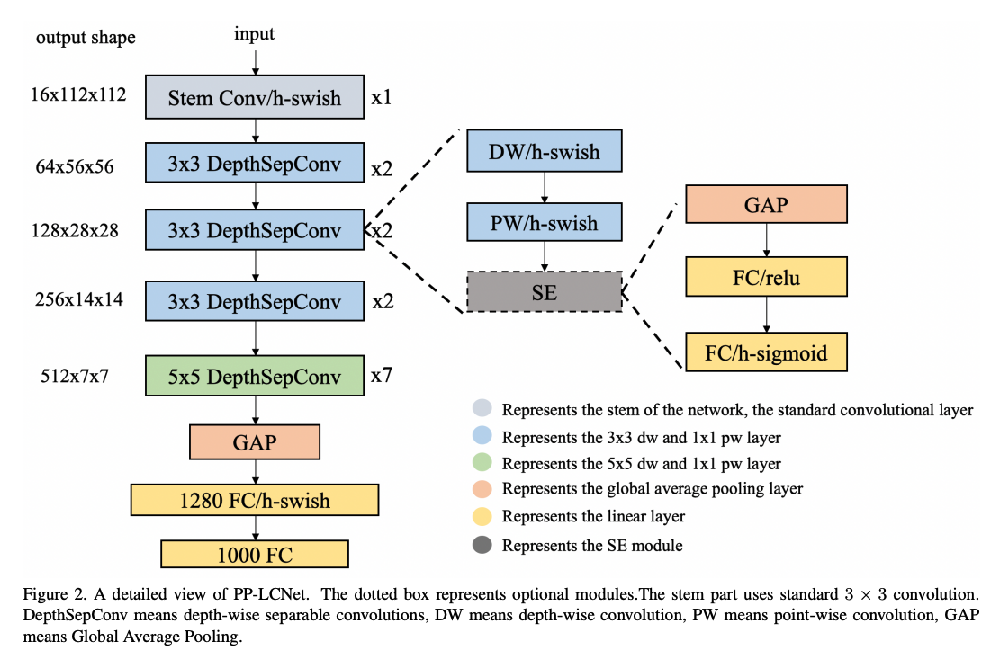

[keras] PP-LCNet
===
## Architecture

## Problem Definition
Testing PP-LCNet and general CNN 
Are The result of PP-LCNet and general CNN same?

## Result
||general CNN|PP-LCNet|
|-|----------|--------|
|Loss|||
|Acc|||
|params|||

Performance is about the same. However, the parameters decreased by 13%.

## Enviroment
- Python : 3.7.10 
- Tensorflow : 2.3.0  

## Reference
[1] Cui, Cheng, et al. "PP-LCNet: A Lightweight CPU Convolutional Neural Network." arXiv preprint arXiv:2109.15099 (2021). 